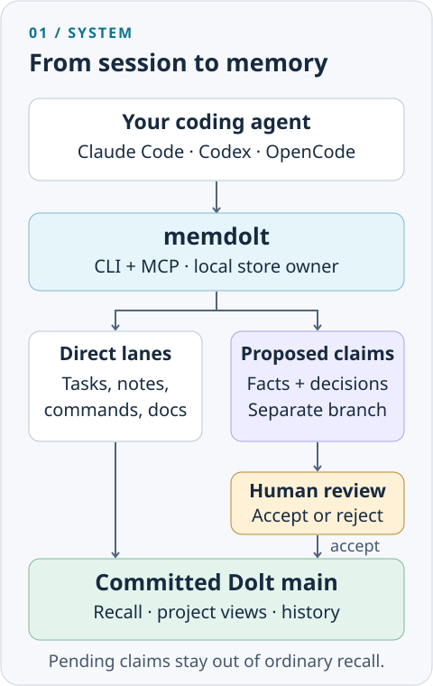
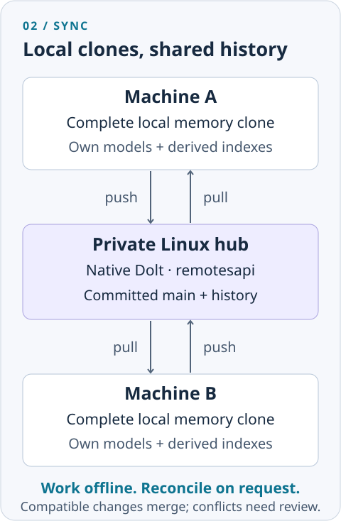
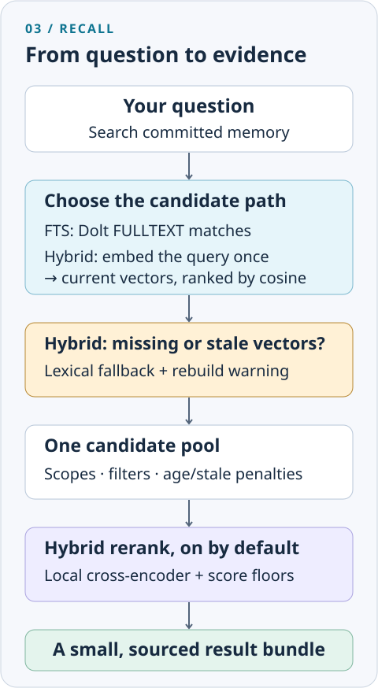

# memdolt

*Project memory your agents can recall. A history you can review.*

  
  
  
   
  
  
  

Every new coding session needs context: the build command, a design decision,
the reason a shortcut exists. memdolt keeps that knowledge beside your code,
so Claude Code, Codex, and OpenCode can look it up instead of asking again.

It is a Go CLI and MCP server backed by **Dolt**, a database with Git-like
branches, diffs, merges, and history. Agents propose facts and decisions on
separate branches; you review what becomes accepted memory. Each machine can
work from its own local clone and push or pull committed memory through a hub
you control. Semantic inference runs on the client with separately provisioned,
verified models.

**[Quickstart](#quickstart)** · **[How it works](#how-it-works)** ·
**[Project status](#project-status)** · **[Cross-machine setup](#moving-between-machines)** ·
**[Reference](#reference)**

## Quickstart

Start with one local project. You need Git, **Go 1.26.2 or newer**, and a C
compiler: GCC or Clang on Linux/macOS, or MinGW-w64 on Windows. Both
`CGO_ENABLED=1` and the `gms_pure_go` build tag are required; the tag removes
the ICU requirement, but does not remove cgo.

These prompts install a **client**, connect your agent, and offer
[guided project bootstrap](#guided-project-bootstrap). Models, global memory,
and a remote hub are separate opt-ins. If the project already has memory on a
remote, use `clone` instead of `init`.

<b>Install with Claude Code</b>

Open Claude Code in the project you want to remember, then paste:

~~~text
Set up memdolt as a local client for this project, following
https://github.com/kninetimmy/memdolt/blob/main/README.md.

1. Inspect the project, existing memory, host config, and PATH first.
   Check Git, Go >=1.26.2, and a working C compiler. Clone memdolt into
   an unused source directory, or inspect an existing checkout without
   discarding edits. Set CGO_ENABLED=1 for the build and run:
   go install -tags gms_pure_go ./cmd/memdolt
   from that source checkout. Verify the installed memdolt version.
2. Select this project's absolute root and authoritative memory system.
   Follow the shared onboarding procedure's fresh init/existing clone
   choice before connecting MCP. Inspect existing memory; do not reseed,
   migrate or replace it. Preserve ignore rules and keep .memdolt/ local.
3. Merge the memdolt entry from the source .mcp.json into this project's
   Claude MCP configuration. Preserve every other entry and let Claude
   handle its own trust/approval prompts. Use serve --dir with this
   project's absolute path if the launch directory is not guaranteed.
4. Offer the eight memdolt-* templates in templates/skills/claude/ for
   ~/.claude/commands/, plus templates/skills/memdolt-resources/ for
   ~/.claude/memdolt-resources/. Follow the MCP and hosts copy layout.
   Preserve existing commands, including memhub, and report old aliases
   for human review without deletion. Resolve destination collisions.
5. Reconnect MCP and verify status and tool discovery. Report failures
   accurately; do not claim a live check that you could not perform.
6. Run memdolt-init-project using its installed shared procedure. Ask
   only for missing project context; show state/architecture drafts for
   separate approval. Offer FTS/hybrid, code, docs, global and remote
   choices explicitly. Do not deploy a hub or write sample facts as me.
~~~

<b>Install with Codex</b>

Open Codex in the project you want to remember, then paste:

~~~text
Set up memdolt as a local client for this project, following
https://github.com/kninetimmy/memdolt/blob/main/README.md.

1. Inspect the project, existing memory, host config, and PATH first.
   Check Git, Go >=1.26.2, and a working C compiler. Clone memdolt into
   an unused source directory, or inspect an existing checkout without
   discarding edits. Set CGO_ENABLED=1 for the build and run:
   go install -tags gms_pure_go ./cmd/memdolt
   from that source checkout. Verify the installed memdolt version.
2. Select this project's absolute root and authoritative memory system.
   Follow the shared onboarding procedure's fresh init/existing clone
   choice before connecting MCP. Inspect existing memory; do not reseed,
   migrate or replace it. Preserve ignore rules and keep .memdolt/ local.
3. Inspect ~/.codex/config.toml and merge a memdolt MCP server entry
   using command = "memdolt" and args = ["serve", "--dir", <this
   project's absolute path as a TOML string>]. Preserve all other
   settings. Resolve an existing server name before changing it.
   Let Codex handle project trust; do not silently mark paths trusted.
4. Offer the eight memdolt-* directories in templates/skills/codex/ for
   ~/.codex/skills/, plus templates/skills/memdolt-resources/ for
   ~/.codex/memdolt-resources/. Follow the MCP and hosts copy layout.
   Preserve existing skills, including memhub, and report old aliases
   for human review without deletion. Resolve destination collisions.
5. Reconnect MCP and verify status and tool discovery. Report failures
   accurately; do not claim a live check that you could not perform.
6. Run memdolt-init-project using its installed shared procedure. Ask
   only for missing project context; show state/architecture drafts for
   separate approval. Offer FTS/hybrid, code, docs, global and remote
   choices explicitly. Do not deploy a hub or write sample facts as me.
~~~

<b>Install with OpenCode</b>

Open OpenCode in the project you want to remember, then paste:

~~~text
Set up memdolt as a local client for this project, following
https://github.com/kninetimmy/memdolt/blob/main/README.md.

1. Inspect the project, existing memory, host config, and PATH first.
   Check Git, Go >=1.26.2, and a working C compiler. Clone memdolt into
   an unused source directory, or inspect an existing checkout without
   discarding edits. Set CGO_ENABLED=1 for the build and run:
   go install -tags gms_pure_go ./cmd/memdolt
   from that source checkout. Verify the installed memdolt version.
2. Select this project's absolute root and authoritative memory system.
   Follow the shared onboarding procedure's fresh init/existing clone
   choice before connecting MCP. Inspect existing memory; do not reseed,
   migrate or replace it. Preserve ignore rules and keep .memdolt/ local.
3. Inspect the installed OpenCode version and existing JSON/JSONC.
   The source opencode.json is a native V2 example: merge its
   mcp.servers.memdolt entry, commands, and a real skills path.
   Do not replace the whole configuration or copy a relative skills
   path that does not exist in this project. Preserve user settings.
4. Offer the eight memdolt-* directories in templates/skills/opencode/
   for ~/.config/opencode/skills/, plus templates/skills/memdolt-resources/
   for ~/.config/opencode/memdolt-resources/. Preserve existing skills,
   including memhub; report old aliases for human review without deletion.
   Resolve destination collisions and follow the MCP and hosts copy layout.
   Bind serve --dir to this project if the launch directory is unclear.
5. Reconnect MCP and check status and tool discovery. Run doctor for
   its registration advisory. Before any OpenCode wrap-up, obtain the
   current session ID from host context and follow the shipped skill's
   session-info verification; never guess or discover another session.
6. Run memdolt-init-project using its installed shared procedure. Ask
   only for missing project context; show state/architecture drafts for
   separate approval. Offer FTS/hybrid, code, docs, global and remote
   choices explicitly. Do not deploy a hub or write sample facts as me.
~~~

<b>Install by hand</b> — build, initialize, and try a small local example

Clone the source into a new directory, then build from its root:

~~~sh
git clone https://github.com/kninetimmy/memdolt.git
cd memdolt
~~~

On Linux or macOS:

~~~sh
export CGO_ENABLED=1
go build -tags gms_pure_go -o memdolt ./cmd/memdolt
./memdolt version
go install -tags gms_pure_go ./cmd/memdolt
~~~

On Windows PowerShell:

~~~powershell
$env:CGO_ENABLED = "1"
go build -tags gms_pure_go -o memdolt.exe ./cmd/memdolt
.\memdolt.exe version
go install -tags gms_pure_go ./cmd/memdolt
~~~

Put Go's install directory on PATH: `go env GOBIN` if set, otherwise the
`bin` directory under `go env GOPATH`. Then open a terminal in **your target
project**. Preserve its existing `.gitignore` and add `.memdolt/` if needed;
`init` creates the store, not host configuration or Git ignore rules.

~~~sh
memdolt version
memdolt init
memdolt doctor
memdolt repo status --local
memdolt render
~~~

For a disposable practice project, these human CLI commands give you something
to recall. In a real project, record only claims you have verified:

~~~sh
memdolt fact add demo.storage "Memory stays in a local Dolt clone."
memdolt decision add "Try local memory first" --rationale "Learn review before adding a remote."
memdolt task add "Review the practice memory"
memdolt note add "Completed the local quickstart."
memdolt recall "local memory" --mode fts --max-results 3
memdolt render
~~~

Read `.memdolt/rendered/PROJECT.md` and `PROJECT_LEDGER.md`. This path needs
no models or hub. `doctor` may warn that optional OpenCode registration is
absent; it does not certify a live host connection.

Follow [MCP and hosts](#mcp-and-hosts) to connect an agent, and
[Local models and retrieval](#local-models-and-retrieval) for semantic recall.
Use `--dir <repository>` when running store commands from elsewhere.

### Guided project bootstrap

After installing the [host workflows](#mcp-and-hosts), invoke
`memdolt-init-project`. Before #155, the install prompts primarily established
an empty store and connection. Now the
[shared onboarding procedure](templates/skills/memdolt-resources/onboarding.md)
also guides project context and separately approved state/architecture drafts:

1. Inspect the selected project root, instructions, manifests, host bindings and
   existing memory. Explicitly choose the authoritative memory system; preserve
   memhub when it remains authoritative. Inspect existing source narratives
   instead of reseeding them.
2. Choose fresh `init`, an existing remote `clone`, or continued local memory.
   Optional migration requires a separately approved disposable rehearsal.
3. Infer purpose, stack, build/test/run commands and constraints. Ask only for
   missing information; show separate state and architecture drafts for review.
4. Choose FTS or verified local hybrid models, optional code indexing, a selected
   Markdown document, global memory and remote setup. Downloads, ingestion and
   transfers remain explicit choices; preserve existing configuration tables.
5. Write only approved changed narratives using stdin and the actual host actor.
   For example, with a selected root and reviewed UTF-8 file, a Codex POSIX-shell
   invocation is `memdolt state set --dir "$memdolt_repo" --actor codex --json < "$approved_state_file"`;
   `arch set` uses the same stdin shape. Claude uses `--actor "Claude Code"` and
   OpenCode uses `--actor opencode`. There is no `--from-file` flag. Read back
   content/attribution, run approved project checks, and record only their
   observed command outcomes. Follow the shared procedure for PowerShell.
6. Render and inspect the generated narratives. Narratives are not recall
   sources, so narrative-only memory can correctly return blank recall. Verify
   recall/locate only against actual selected content. Separately check live
   host workflow/tool discovery and the MCP `status` target; `doctor` is not
   proof of live-agent behavior.

Use `memdolt-wrap-up` to inspect and separately approve later state/architecture
changes before rendering. Unchanged or rejected narratives need no write.
Facts/decisions still use agent proposals and human review. A confirmed write
is not replayed to repair a later render failure; inspect its ID/hash and the
reported outputs first. This ships workflow guidance and package/CLI checks,
without an installer, runtime wizard, automatic migration or live-host setup.

## How it works

### The system and the review gate

  

Your memory lives in `.memdolt/dolt/memory`. A fact or decision proposed by
an agent gets its own `proposal/<ulid>` branch and one staging commit. Review
shows the diff; human acceptance merges it into `main`. Pending proposals
stay out of ordinary recall and rendered views. Tasks, notes, commands, and
other defined direct lanes have their own write rules.

### Local clones, one shared remote

  

Work locally, including while disconnected. `push` and `pull` exchange
committed `main` and its history; compatible changes merge, and actual
conflicts need explicit choices. Pending proposal branches and queued notes
are not transferred. The hub is optional; [setup is separate](#self-host-a-hub).

### Inside a recall

  

`fts` mode uses Dolt FULLTEXT. In `hybrid` mode, **current vectors choose
the candidates**, then a local cross-encoder reranks the pool by default.
Rows with missing or stale vectors can enter through lexical fallback and
produce a rebuild warning. This is the shipped memdolt pipeline; the code
locator has a separate scoring path.

These are static SVGs with all content visible, including for reduced-motion
readers. No animation or external image assets are needed.

## What you actually get

- **Useful context across sessions.** Recall the relevant facts, decisions,
  tasks, or document sections without loading an entire ledger.
- **Reasons that survive.** Decisions retain rationale, alternatives, and
  evidence; Dolt records when memory changed and who changed it.
- **A reviewable memory.** Agent claims arrive as small diffs before entering
  accepted memory.
- **Searchable docs and code.** Ingest a design spec, or find tracked code by
  intent with short `file:line` breadcrumbs.
- **Continuity across tools and machines.** Clients use the same memory model;
  local clones reconcile through normal Dolt history.
- **Local control.** No hosted inference API is required. Models and derived
  indexes stay on your machine; remote transfer happens when requested.

## A session in practice

An illustrative session after MCP setup and some memory has been saved:

~~~text
You:   "Why did we choose the embedded database?"
Agent: Calls recall and returns the relevant decision and rationale.

You:   "Add a task to document recovery."
Agent: Calls task_add. The task is committed directly.

You:   "The recovery guide should include a restore drill."
Agent: Proposes a decision. Its branch is pending; main is unchanged.

You:   "Wrap up."
Agent: Shows proposed updates and a session summary for approval,
       writes approved direct-lane items, stages claims, and renders.
       A human still reviews and accepts the fact/decision proposals.
~~~

Use the supplied wrap-up skill for your host. Approving a draft authorizes
staging it; promotion is a separate human review. With form-capable MCP
clients, `review_pending` offers that review in the host. The terminal path
is available too:

~~~sh
memdolt review list
memdolt review show <proposal-id>
memdolt review accept <proposal-id>
memdolt render
~~~

## Project status

**Active development, with usable local workflows and additional acceptance
work remaining.** This is a source-tree snapshot, not a claim of production
hub acceptance or complete memhub parity.

| Area | Delivered | Remaining boundary |
| --- | --- | --- |
| Foundations and M0–M3 | Local Dolt, ownership/IPC, reviewed writes, retrieval gates, 22 MCP tools, host templates | M0's recorded GO has scoped limits. Live Claude acceptance was explicitly waived; deterministic compatibility and a real OpenCode provenance write supplied the replacement M3 evidence. |
| M4: cross-machine memory | Clone, remotes, status/diff, push/pull, compatible merges, human conflict choices, Linux hub artifacts, isolated native ingress tests, repository identity and local/clone topology | Before #163 topology/project identity remained pending; they now ship. Physical two-client/private-network and client version-skew acceptance remain. Live SQL-to-hub storage is unsupported. |
| M5: memory workflows | Documents, code locator and golden gates, rendering, human fact/decision commands, global replicas with combined recall, terminal global proposal acceptance, JSON import/export | Before #161 global-target proposal acceptance refused; it now ships through terminal human review. Audit-md, Git/file-history ingestion, top-level status/stats/history, remaining wrap-up policy, and the full parity audit remain. |
| M6: operations | Existing scoped health checks and deployment runbook | Backups and restore drill, `doctor --hub`, retention/GC, upgrades, gated token accounting, and local transcript archives remain planned. |

The maintainer still uses memhub; migration is optional and has not been
performed. Read the [milestones and product authority](docs/prd/memdolt-prd.md),
[M0 gate](docs/spikes/m0-gate.md), and
[M3 acceptance evidence](docs/spikes/m3-acceptance.md) for the exact limits.

## What gets saved, and when

| Memory | Purpose | How it reaches committed `main` |
| --- | --- | --- |
| Facts and decisions | Project knowledge and choices with reasons | Humans can write through the trusted CLI; agents stage proposals for human review. |
| Tasks | Open, done, and blocked work | Direct attributed commits. |
| Session notes | Session observations; excluded from recall | CLI notes commit immediately. MCP notes queue until the five-minute deadline, explicit session render, or orderly shutdown. |
| Commands | Observed build/test/run/lint results and counts | Direct attributed commits; recording does not run the command. |
| State and architecture | Versioned project narratives | Direct CLI `state set` / `arch set` commits; included in rendered views. |
| Reference documents | Selected Markdown and heading-aware chunks | Each changed add/remove is a direct commit; unchanged content is a no-op. |

Human review keeps both the agent's proposed source and the reviewer's commit
attribution. Agents must not impersonate `user` or use trusted human commands
to bypass review. Repository acceptance also checks for potential
contradictions using the local model; inference errors refuse acceptance.
`review reject` discards a pending proposal instead.

`render` publishes committed memory into local Markdown. Through a live MCP
owner it first flushes that owner's queued notes. A crash can lose uncommitted
queued notes. A returned commit hash confirms a write even if a later step
fails; an unknown result calls for inspection before retry, not an assumption
that the write rolled back.

## Point it at your design docs

Select a Markdown file, then build its local vectors if using hybrid recall:

~~~sh
memdolt doc add docs/design.md
memdolt index rebuild
memdolt recall "recovery strategy" --mode hybrid --source-type doc_chunk
memdolt doc ls
~~~

The example file path is yours to choose. Ingestion preserves heading
breadcrumbs and replaces all chunks when content changes. First ingestion
enables `[retrieval] include_docs_in_default`; automatic document inclusion
requires hybrid reranking and its relevance floor. Explicit `--source-type
doc_chunk` works for targeted queries, including `--mode fts`.

Use `doc show <id-or-path>` and `doc rm <id-or-path>` to inspect or remove a
document. Set `include_docs_in_default = false` to opt out of default
inclusion. MCP ingestion confines sources to the project or configured
`[doc] allowed_dirs`; the CLI accepts an explicitly selected external file.

Document text and chunks travel with Dolt history. Source paths remain
metadata, not portable file aliases; select a document ID on another machine.
Documents are excluded from JSON interop bundles. See the
[PRD's document contract](docs/prd/memdolt-prd.md) and
[global document guide](docs/global-memory.md).

## Find where code lives

~~~sh
memdolt code index
memdolt locate "where are retries handled" --limit 3
memdolt code status
~~~

The locator indexes local Git-tracked source into
`.memdolt/code_index.sqlite`. It supports Go, Rust, Python, Java, C#,
JavaScript/JSX, and TypeScript/TSX. Results contain ranked paths, line ranges,
symbols, and snippets capped at six lines and 400 characters.

`locate` refreshes lazily; `code index` pays that cost up front. This works
without initializing a Dolt memory store. Hybrid code indexing can provision
models, and the index is local: it never enters memory recall or sync.
Treat results as navigation leads; the default locator has no nonsense floor.
Read the [code locator guide](docs/code-locator.md) for filters, freshness
limits, configuration, and evaluation.

## One machine, many projects

Initialize memory in each project you choose. Each gets its own
`.memdolt/` directory, review queue, and history; `--dir` selects the target.
The shipped setup does not create a machine-wide known-project registry.

One process owns a local Dolt store at a time. Each `memdolt serve` opens and
holds it while serving MCP; a second host's MCP server competes for that clone.
Hand off by stopping the old host's owner cleanly before starting the next.
Supported CLI operations reach the live owner through authenticated local IPC.
With no owner, the CLI opens the store directly. Stop the owner before
initialization/migration, and inspect ownership errors with `doctor`.

### Shared memory across projects

For standing policies and toolchain facts, opt each calling repository into a
separate global replica. From an already initialized project, bootstrap it
once on this machine:

~~~sh
memdolt global enable
memdolt global init
memdolt global status
~~~

It lives at `~/.memdolt/global/.memdolt/dolt/memory`. If a shared global
remote already exists, use `global clone <remote-url>` instead of `global
init`. Other local projects only need `global enable` to use this replica.

Human `fact`, `decision`, and `doc` operations accept `--global`.
`fact promote <id-or-key> --global` and `decision promote <id> --global`
copy a repository row while retaining source commit evidence. Combined recall
labels scope and captures one committed snapshot per scope. Global tasks,
notes, narratives, and code are excluded.

**Before #161 global proposal acceptance was not implemented:** its terminal
remedy still led to a refusal. Now a trusted human can inspect and run
`memdolt review accept <id> --dir <repository>` to accept the exact payload
into the enabled existing global replica. Repository main stays unchanged;
source branches remain for inspection. Repeats verify native history without
another merge. MCP review still excludes global proposals. Inspect both stores
and reported hashes after partial/unknown outcomes; see the
[global acceptance and recovery guide](docs/global-memory.md#terminal-proposal-acceptance-issue-161).
The [global memory guide](docs/global-memory.md) covers enablement, locks,
collisions, document defaults, sync, and recovery.

## Moving between machines

Before #163, `[repo]` TOML was ignored and init did not record project identity.
Now equivalent supported Git SSH/HTTPS origins produce one memhub-compatible
project ID and safe hub database name, recorded in an attributed init commit.
Existing unidentified stores require deliberate `init --adopt-identity` with
the owner stopped; changed origins and conflicting identities refuse. Local
use without a Git origin remains available. See the
[identity, topology and recovery guide](docs/repository-topology.md).

The first #163 review correction closes three gaps: configuration case aliases
now refuse, identity checks read captured commits rather than dirty native rows,
and drive-relative/non-ASCII origins cannot become shared identities. Existing
working data and unrelated configuration remain preserved.

`repo configure --topology local` keeps ordinary status offline; explicit
transfers and named remote status remain available. `--topology clone` uses
the existing native transfer path. Optional `--remote-url` supplies default
origin if absent, and must match a native origin exactly when both exist.
Other explicitly named remotes retain their own target. Configure with the
owner stopped; only supplied keys change and unrelated TOML values survive.
`live` now refuses instead of silently using local data.

`repo configure --auto-pull-on-session-start` is an opt-in requiring clone.
It runs pull once before `serve` publishes MCP/IPC, never on CLI opens. Startup
merges are attributed to memdolt; conflicts and failures stop startup with
inspection remedies. No approvals or uncertain operations are replayed. The
default remains off; global memory retains separate explicit transfers.

For an existing local repository, invoke `memdolt-catch-up` after installing
the [host workflows](#mcp-and-hosts). Its
[shared procedure](templates/skills/memdolt-resources/catch-up.md) verifies
the target and selected remote, fetches status, performs authorized pull/merge
with human conflict choices, then refreshes applicable local vectors and
rendered context. Existing authorization carries forward. Model provisioning
is a separate choice; session render can commit queued notes. It reports
confirmed/unknown/partial effects and the refreshed queue without auto-pushing.

Each client gets a local clone. The URLs below are **placeholders** for an
already configured remotesapi endpoint and database, not an address to deploy:

~~~sh
# First client, after local init and after preparing the remote:
memdolt repo remote add origin https://hub.example/project --user <sql-user>
memdolt push

# Another client, in a project with no local memory database:
memdolt clone https://hub.example/project --user <sql-user>
memdolt repo status
memdolt pull
memdolt render
~~~

Remote passwords come only from `DOLT_REMOTE_PASSWORD` in the process
executing the transfer. When a live MCP owner handles it, that owner needs
the environment value; the CLI does not forward its password. Keep passwords
out of URLs, command arguments, and committed configuration.

After an authorized pull/merge, run `index status` and approved `index rebuild`
as needed, and refresh rendered views explicitly. A normal session is selected
remote → pull/merge → refresh vectors/views → work → review → wrap-up/render
and note flush → authorized push. Push publishes committed `main`, with no force option; it
does not flush notes, accept proposals, or publish local indexes.

`repo status --diff` shows committed local-to-remote differences;
`repo status --local` stays offline. A conflicted `pull --json` reports the
choices needed. Review the full result and supply a complete resolution with
`pull --resolve <file>`, or use explicit human forms in a capable MCP host.
There is no Drive snapshot adoption step. Pending proposals/queued notes do
not transfer; models, indexes, views and configuration remain local. Global
memory uses separate remotes, explicit `--global` transfers and local refresh.
Remote-aware status fetches and also needs transfer authorization. See the
[transfer and conflict contract](docs/prd/memdolt-prd.md).

### Self-host a hub

A hub is a separate native Dolt SQL server on Linux, reachable through a
private network such as Tailscale. Clients use remotesapi for push/pull;
inference stays on the clients. Solo local use needs no server.

`memdolt hub init` generates six reviewable, nonsecret deployment artifacts;
it does not install services, create accounts, or apply a firewall. Managed
startup requires native **Dolt 1.88.1**, systemd, nftables, and the configured
private IPv4/IPv6 interface. The ingress boundary covers both SQL and the
independent remotesapi listener. Binding SQL alone is insufficient.

Follow the [hub deployment runbook](docs/hub-deployment.md) for verified
native binaries, generation flags, credentials, permissions, startup, and
`hub status --config <hub.json>`. Isolated Linux enforcement tests have
shipped; a real two-client deployment and physical off-network acceptance
remain to be completed.

## Reference

### Everyday commands

Use `memdolt <command> --help` for exact arguments. `--json` selects structured
output; store-oriented commands accept `--dir`.

| Command family | Purpose |
| --- | --- |
| `init` · `doctor` · `version` | Initialize/migrate explicitly, inspect health, identify the binary |
| `recall` · `search` | Ranked memory recall; lexical search of committed decisions |
| `fact add/list/verify/supersede` | Trusted human fact operations |
| `decision add/list/set-summary/supersede` | Trusted human decision operations |
| `task add/list/done/block` · `note add/list` | Work queue and session observations |
| `command record/get` · `state set/show` · `arch set/show` | Observed commands and project narratives |
| `review list/show/accept/reject/stale/expire` | Inspect and manage proposal branches |
| `doc add/ls/show/rm` | Selected Markdown and its chunks |
| `code index/status/rm` · `locate` | Local tracked-code navigation |
| `index status/rebuild` · `eval retrieval/locate` | Derived memory vectors and golden evaluations |
| `repo status` · `repo remote add/list` | Inspect memory history and configure remotes |
| `clone` · `pull` · `push` | Transfer committed memory |
| `global enable/disable/status/init/clone` | Opt-in shared local replica |
| `export` · `import` | Portable memory bundles, including optional memhub import |
| `render` · `serve` | Generated views and the stdio MCP server |
| `opencode session-info/wrap-up-note` | Verified OpenCode session provenance |
| `hub init/status/preflight/ready` | Explicit deployment artifacts and startup checks |

### Local models and retrieval

The default `fts` mode needs no model. To try semantic recall after saving
some memory:

~~~sh
memdolt index rebuild
memdolt recall "why keep memory local" --mode hybrid --max-results 3 --provenance
~~~

On first needed use, the inference layer fetches BGE-small-en-v1.5,
ms-marco-MiniLM-L-6-v2, tokenizers, and ONNX Runtime into
`~/.memdolt/models/`. The [committed manifest](models/manifest.json) pins
revisions and SHA-256 digests; files are verified before loading. Existing
files with mismatched hashes refuse instead of being silently replaced.
Models are **not embedded in the binary**. Pre-position the exact verified
artifacts for offline use.

Inference runtimes are pinned for Windows AMD64, Linux AMD64/ARM64, and macOS
ARM64. The model pipeline is CPU-only; after provisioning, inference needs no
network or hosted API. Model downloads and explicitly requested remote
operations do use the network.

To make hybrid recall the default, merge this into the existing
`.memdolt/config.toml`, preserving its other tables:

~~~toml
[retrieval]
mode = "hybrid"                 # default without config: "fts"
default_max_results = 6
use_reranker = true
rerank_candidate_pool = 20
~~~

`--accepted-only` filters to user/reviewed sources; `--include-stale=false`
hides old facts. By default, stale facts are included with a penalty after
90 days without verification, and accepted-only filtering is off. Superseded
rows retain a ranking penalty. `--provenance` adds last-changing commit
evidence; enabled global recall also labels scope and snapshot commit.
`--no-rerank` disables the hybrid reranker for a call.

Memory vectors live in `.memdolt/embeddings.sqlite` and are checked against
current source hashes. Rebuild after changed memory or a pull; recall does not
silently rebuild them. Recall does not write durable memory, though it records
local empty-result counters in the derived side-store.

### MCP and hosts

`memdolt serve` serves stdio MCP. This repository includes a Claude
[`.mcp.json`](.mcp.json), a native V2 OpenCode
[`opencode.json`](opencode.json), and
[templates for all three hosts](templates/skills).
They are examples to merge when configuring another project, not installers.

For Codex, merge an entry into `~/.codex/config.toml`, replacing the sample
path with the intended project's absolute path:

~~~toml
[mcp_servers.memdolt]
command = "memdolt"
args = ["serve", "--dir", "/absolute/path/to/project"]
~~~

On Windows, a TOML literal string such as `'C:\path\to\project'` avoids
backslash escapes. Preserve existing MCP entries and use distinct server
names for separately bound projects. Reconnect the host and verify its live
tool discovery. `doctor` checks store health and recognizes OpenCode
registration; it does not validate all three hosts or grant trust.

Before #155, six generic workflows shipped: **check-init, recall, wrap-up,
locate, eval-locate, global**. After it, seven entry points used
namespaced filenames/directories and frontmatter: **memdolt-check-init,
memdolt-eval-locate, memdolt-global, memdolt-init-project, memdolt-locate,
memdolt-recall, memdolt-wrap-up**. Issue #157 adds **memdolt-catch-up** as the
eighth, preserving those workflows and native MCP registrations. Install only
selected workflows using this copy layout; copy the shared resources with
onboarding or catch-up:

| Host | Source | User destination |
| --- | --- | --- |
| Claude Code | [`templates/skills/claude/memdolt-*.md`](templates/skills/claude) | `~/.claude/commands/memdolt-*.md` |
| Codex | [`templates/skills/codex/memdolt-*/`](templates/skills/codex) | `~/.codex/skills/memdolt-*/` |
| OpenCode | [`templates/skills/opencode/memdolt-*/`](templates/skills/opencode) | `~/.config/opencode/skills/memdolt-*/` |
| Each selected host | [`templates/skills/memdolt-resources/`](templates/skills/memdolt-resources) | `~/.claude/memdolt-resources/`, `~/.codex/memdolt-resources/`, or `~/.config/opencode/memdolt-resources/` |

Copy each selected file/directory with its name intact. The resource directory
is a **sibling** of `commands/` or `skills/`, outside workflow discovery.
Claude's shared links use `../memdolt-resources/`; Codex and OpenCode use
`../../memdolt-resources/` from their `SKILL.md`. The resource filenames are
`onboarding.md` and `catch-up.md`; keep both together so onboarding's link to
catch-up also resolves.
Resolve links relative to the installed entry point, not the project directory.
This layout works with a target project that has no Memdolt source checkout.

Inspect every destination before copying. Preserve existing generic memhub
skills, unrelated host entries and trust settings. If a namespaced destination
differs, present the specific collision for human resolution instead of
overwriting it. Report old installed generic aliases and their paths/ownership
for human review; do not delete them. Explicitly select the repository's
authoritative memory system in its instructions, and bind MCP to its absolute
root. Verify live `status.dataDir` is that root's `.memdolt/dolt` (the database
is its `memory` child) before using tools, especially with multiple Codex server
entries. Preserve host trust prompts; installation never grants trust.

The OpenCode example's `skills` array points to this source checkout's
`templates/skills/opencode`. For a copied installation, merge the actual
absolute `~/.config/opencode/skills` path into the existing array; do not copy
the example's relative path into an unrelated project. Its plural `commands`
map uses the exact `memdolt-*` skill names; merge only selected wrappers and
preserve unrelated commands. Reconnect and verify the new names in live host
discovery. OpenCode wrap-up
requires a host-provided current session ID and independently verified API
metadata before writing.

The **22 registered tools** are:

- Reads/navigation: `status`, `repo_status`, `recall`, `search`, `locate`,
  `list_tasks`, `list_decisions`, `list_facts`, `list_proposals`, `get_command`.
- Direct/session operations: `task_add`, `task_done`, `log_session_note`,
  `record_command`, `doc_add`, `render`.
- Proposed writes and human review: `propose_fact`, `propose_decision`,
  `propose_supersede`, `review_pending`.
- Requested transfers: `repo_pull`, `repo_push`.

### Interoperability and migration

~~~sh
memdolt export ./memory.json
memdolt import ./memory.json --dir <fresh-initialized-project>
memdolt import --from-memhub ./memhub-export.json --dir <fresh-initialized-project>
~~~

Use an existing local parent for the bundle. Import requires current, clean,
empty durable memory with no proposal branches. There is no force-wipe mode.
Bundles retain supported memory rows and pending repository proposals, but
exclude documents, models, indexes, configuration, and the original Dolt
commit graph. They are not a full-instance backup or a synchronization format.
Read the [migration guide](docs/migration.md) before importing real data.

### Verification and secrets

Configure `[deny_list] patterns` in `.memdolt/config.toml` as Go regular
expressions. These are not memhub path globs. Invalid policy fails closed;
code indexing also has fixed secret-path exclusions. Keep secrets out of
memory in the first place: deleting today's row does not erase Dolt history.

From the source checkout, with cgo and the C compiler configured:

~~~sh
go test -tags gms_pure_go ./cmd/memdolt
go test -tags gms_pure_go ./...
go vet -tags gms_pure_go ./...
~~~

[CI](.github/workflows/ci.yml) adds formatting/lint, cross-platform tests,
the race detector, golden retrieval/locator gates, and isolated Linux hub
ingress checks. Evaluation commands need their matching corpus and model
artifacts; the [code locator guide](docs/code-locator.md) and
[PRD](docs/prd/memdolt-prd.md) specify those gates.

## How it is built

The CLI and MCP tools share application operations. Local store ownership and
authenticated IPC keep cooperating processes from opening competing embedded
engines. Dolt owns versioned source memory; SQLite holds rebuildable local
indexes. A shared remote is native Dolt, with no inference service on the hub.

~~~text
cmd/memdolt/               CLI and stdio server lifecycle
internal/mcpserver/        Tools, host attribution, human review forms
internal/memory/           Direct memory lanes
internal/review/           Proposal acceptance and guardrails
internal/store/localdolt/  Embedded Dolt, documents, transfers, global memory
internal/storeipc/         Authenticated owner operations
internal/retrieval/        Memory ranking and reranking
internal/scopedrecall/     Repository/global recall policy
internal/embedding/        Verified local inference and memory vectors
internal/codeindex/        Tracked-source chunking and code navigation
internal/render/           Committed-memory Markdown and bundle files
internal/hub/              Deployment artifacts and private startup checks
~~~

The important storage split:

| Location | Contents | Travels through push/pull? |
| --- | --- | --- |
| `<project>/.memdolt/dolt/memory` | Dolt memory database, documents, commit graph, local proposal branches | Committed `main` and its history; pending branches stay local |
| `<project>/.memdolt/embeddings.sqlite` | Derived memory vectors and local recall counters | No |
| `<project>/.memdolt/code_index.sqlite` | Derived index of local tracked source | No |
| `<project>/.memdolt/rendered/` | Generated `PROJECT.md` / `PROJECT_LEDGER.md` | No |
| `<project>/.memdolt/config.toml` | Per-project, per-machine policy | No |
| `~/.memdolt/models/` | Verified model and runtime artifacts | No |
| `~/.memdolt/global/.memdolt/` | Separate global replica and its own derived files | Its committed memory, through explicit `--global` transfers |

## Principles

- **Local first.** Keep a complete memory clone and run inference on clients.
- **Agents propose; humans promote.** Preserve the review boundary and
  attribution, including when the tools change.
- **History is part of memory.** Retain decisions, supersessions, and real
  commit evidence instead of flattening everything into the latest text.
- **Derived data stays derived.** Rebuild vectors and code indexes locally;
  version source knowledge in Dolt.
- **Failures stay visible.** Preserve confirmed progress and inspect unknown
  outcomes before retrying.
- **Ship bounded features.** Keep acceptance evidence and unfinished work
  explicit.

## Further reading

- [Product requirements](docs/prd/memdolt-prd.md) — authority, parity matrix,
  detailed command contracts, and milestone gates
- [Hub deployment](docs/hub-deployment.md) — native Linux setup and its
  measured boundary
- [Global memory](docs/global-memory.md) — per-project opt-in and shared replicas
- [Code locator](docs/code-locator.md) — indexing, scoring, and golden checks
- [Migration and interoperability](docs/migration.md) — formats, exclusions,
  safe adoption, and recovery
- [M0 gate](docs/spikes/m0-gate.md) and
  [M3 host acceptance](docs/spikes/m3-acceptance.md) — evidence and limits
- [Host workflows](templates/skills) and
  [server instructions](internal/mcpserver/instructions.md) — shipped agent behavior
- [memhub](https://github.com/kninetimmy/memhub) — the original project and
  the reader journey that inspired this README
- [Apache 2.0 license](LICENSE)
